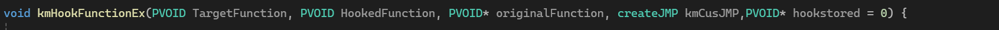
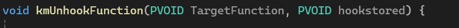
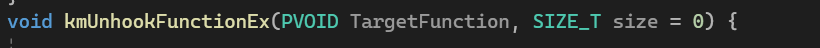
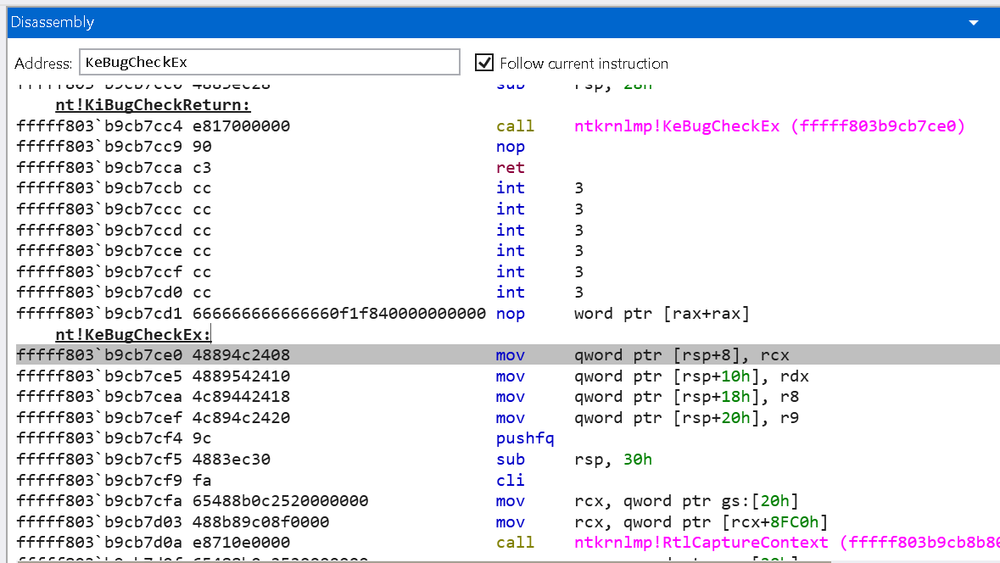
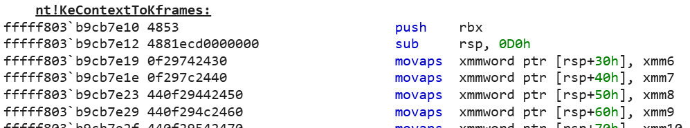
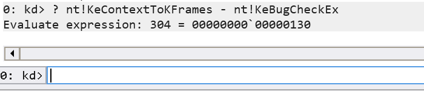

# KmHookX
A comprehensive hooking mechanism that fixes offsets and places a trampoline at the beginning of a function. It writes to an unused function location, then uses a 16-bit displacement offset to jump into the trampoline. This process is guided by disassembly using the Capstone framework for precise analysis.
# How does it work?
KmHookX overrides the untriggered function (CarCopyRuleViolationDetails) with a simple mov rax and jmp rax shellcode:


Then, KmHookX creates an exact copy of a function in an allocated pool, it writes a jmp 16-bit displacement to the untriggered function (CarCopyRuleViolationDetails) (JMP nt!CarCopyRuleViolationDetails) and shifts the whole function down by 5 bytes overriding the INT3s at the end of the function: 


KmHookX takes that allocated pool, and changes all of the offsets to the correct offset ensuring that the flow wont jump into an invalid address.
After that, KmHookX commits the contents in the pool to the target function with the modifications applied. The original function is stored at nt!target_function+0x5 now.

and thats it, you can monitor all of functions no matter if its in ntoskrnl or win32kfull.sys.

# How to use it?
1. Clone this repo using (git clone https://github.com/krypt0nx/KmHookX.git) and move it to any folder in your favor.
2. Open the cloned repo, and open folder cs_driver.
3. Open cs_driver.sln with visual studio.
4. press Build->Rebuild solution
5. When your done, in solution explorer, right click on "capstone_static" and press "unload project".

And your done! Now you can edit the file main.cpp and use the hooking library. If you need, you can integrate your existing project there. 

# Library usage

### 1. KmHookFunction


### Description:
  A function that hooks any function in ntoskrnl.exe.
#### Parameters:

- **TargetFunction**: Function you want to hook/modify. *(MUST BE IN `NTOSKRNL.exe` or `nt!`...)*
- **HookedFunction**: Your function where the hooked function will jump.
- **originalFunction**: Pointer to your function object that will store the original function. **CAN BE NULL** if you wish to not use the original function. Must be `&(PVOID&)yourfunction`.
- **hookstored**: Pointer to your `PVOID` object where you store the original function backup. *(USABLE IF YOU WILL UNHOOK THE FUNCTION LATER. DO NOT USE IT IF THE FUNCTION IS CALLED FREQUENTLY.)*

#### Example: 

Here we are hooking KeBugCheckEx and printing a message whenever its triggered: 

```cpp
#include "kmHook.h"

typedef NTSTATUS(*KeBugCheckExc)(
    _In_ ULONG BugCheckCode,
    _In_ ULONG_PTR BugCheckParameter1,
    _In_ ULONG_PTR BugCheckParameter2,
    _In_ ULONG_PTR BugCheckParameter3,
    _In_ ULONG_PTR BugCheckParameter4
);

KeBugCheckExc originalFunction;

NTSTATUS HookedBugCheckEx(_In_ ULONG BugCheckCode,
                          _In_ ULONG_PTR BugCheckParameter1,
                          _In_ ULONG_PTR BugCheckParameter2,
                          _In_ ULONG_PTR BugCheckParameter3,
                          _In_ ULONG_PTR BugCheckParameter4) {

    DbgPrint("Oh noeees!!!!!!!!!\n");
    return originalFunction(BugCheckCode, BugCheckParameter1, BugCheckParameter2, BugCheckParameter3, BugCheckParameter4);
}

NTSTATUS DriverEntry() {
    
    kmHookFunction(KeBugCheckEx, HookedBugCheckEx, &(PVOID&)originalFunction);

    return STATUS_SUCCESS;
}

```

### 2. KmHookFunctionEx



### Description:
  A function that hooks any function in any module of your choice.
  You have to find your own untriggered function (A function that never hits a breakpoint/never gets called)
  
#### Parameters:

- **TargetFunction**: Function you want to hook/modify. (CAN BE ANY MODULE)
- **HookedFunction**: Your function where the hooked function will jump.
- **originalFunction**: Pointer to your function object that will store the original function. **CAN BE NULL** if you wish to not use the original function. Must be `&(PVOID&)yourfunction`.
- **KmCusJMP**: A function created by `Deploy_Custom_JMP_Pool` *(SEE UTILS USAGE)* to create a custom JMP
- **hookstored**: Pointer to your `PVOID` object where you store the original function backup. *(USABLE IF YOU WILL UNHOOK THE FUNCTION LATER. DO NOT USE IT IF THE FUNCTION IS CALLED FREQUENTLY.)*

#### Example: 

Here we are hooking KeBugCheckEx and printing a message whenever its triggered: 


```cpp
#include "kmHook.h"

Deploy_Custom_JMP_Pool(MyJMP, "win32kfull.sys", "NtUserResolveDesktopForWOW");  // A function that never gets triggered

typedef BOOLEAN(*fNtEngGdiBitBlt)(PVOID hDCDest, INT XDest, INT YDest, INT Width, INT Height, 
                                  PVOID hDCSrc, INT XSrc, INT YSrc, ULONG dwRop, 
                                  IN ULONG crBackColor, IN FLONG fl);

fNtEngGdiBitBlt NtGdiEngBitBlt;

BOOLEAN MyBitBlt(PVOID hDCDest, INT XDest, INT YDest, INT Width, INT Height, 
                 PVOID hDCSrc, INT XSrc, INT YSrc, ULONG dwRop, IN ULONG crBackColor, IN FLONG fl) {
    kDbg("BitBlt was called!");
    return NtGdiEngBitBlt(hDCDest, XDest, YDest, Width, Height, hDCSrc, XSrc, YSrc, dwRop, crBackColor, fl);
}

NTSTATUS DriverEntry() {
    PVOID win32k = FindModule("win32kfull.sys");
    PVOID NtGdiEngBitBlt_Location = GetFunctionExport(win32k, "NtGdiEngBitBlt"); 

    kmHookFunctionEx(
        NtGdiEngBitBlt_Location,      /// Hook what?

        MyBitBlt,                     // Redirect where?

        &(PVOID&)NtGdiEngBitBlt,      // Original function where?

        MyJMP,                        // JMP function where?

        NULL                          // Create backup??
    );

    return STATUS_SUCCESS;
}

```


### 3. KmIsHooked


### Description:
  A function that checks if the function is already hooked.
  
#### Parameters:

- **TargetFunction**: A function that will be checked 

#### Example: 

Here we are checking if KeBugCheckEx is hooked 

```cpp
#include "kmHook.h"


typedef NTSTATUS(*KeBugCheckExc)(
    _In_ ULONG BugCheckCode,
    _In_ ULONG_PTR BugCheckParameter1,
    _In_ ULONG_PTR BugCheckParameter2,
    _In_ ULONG_PTR BugCheckParameter3,
    _In_ ULONG_PTR BugCheckParameter4
);

KeBugCheckExc originalFunction;

NTSTATUS HookedBugCheckEx(_In_ ULONG BugCheckCode,
    _In_ ULONG_PTR BugCheckParameter1,
    _In_ ULONG_PTR BugCheckParameter2,
    _In_ ULONG_PTR BugCheckParameter3,
    _In_ ULONG_PTR BugCheckParameter4) {

    DbgPrint("Oh noeees!!!!!!!!\n");
    return originalFunction(BugCheckCode, BugCheckParameter1, BugCheckParameter2, BugCheckParameter3, BugCheckParameter4);

}


NTSTATUS DriverEntry() {

    
    if (kmIsHooked(KeBugCheckEx)) 
        kDbg("ITS HOOKED!"); // its already hooked (probably a double-run)
    else 
        kmHookFunction(KeBugCheckEx, HookedBugCheckEx, &(PVOID&)originalFunction); // if not hooked, then hook it.

    return STATUS_SUCCESS;
}


```


### 4. kmUnhookFunction



### Description:
  A function that unhooks the function based on the saved hook (hookstored)
  
#### Parameters:

- **TargetFunction**: A function that will be checked
- **hookstored**: A memory location of the hookstored (Passed thru KmHookFunction/Ex)

#### Example: 

Here we are hooking KeBugCheckEx and then we unhook it

```cpp
#include "kmHook.h"


typedef NTSTATUS(*KeBugCheckExc)(
    _In_ ULONG BugCheckCode,
    _In_ ULONG_PTR BugCheckParameter1,
    _In_ ULONG_PTR BugCheckParameter2,
    _In_ ULONG_PTR BugCheckParameter3,
    _In_ ULONG_PTR BugCheckParameter4
);

KeBugCheckExc originalFunction;

NTSTATUS HookedBugCheckEx(_In_ ULONG BugCheckCode,
    _In_ ULONG_PTR BugCheckParameter1,
    _In_ ULONG_PTR BugCheckParameter2,
    _In_ ULONG_PTR BugCheckParameter3,
    _In_ ULONG_PTR BugCheckParameter4) {

    DbgPrint("Oh noeees!!!!!!!!\n");
    return originalFunction(BugCheckCode, BugCheckParameter1, BugCheckParameter2, BugCheckParameter3, BugCheckParameter4);

}


NTSTATUS DriverEntry() {
    PVOID f_hookstored;
    
    kmHookFunction(KeBugCheckEx, HookedBugCheckEx, &(PVOID&)originalFunction,&f_hookstored); // store the hook in f_hookstored.

    DbgBreakPoint();

    kmUnhookFunction(KeBugCheckEx, f_hookstored);

    return STATUS_SUCCESS;
}


```


### 4. kmUnhookFunctionEx



### Description:
  A function that unhooks the function based on the function size (if its already hooked)

``` Go to the 'How to get size' section if you want to know how you can get the size of the function```
  
#### Parameters:

- **TargetFunction**: A function that will be checked
- **size**: The size of the function in bytes.

#### How to get the function size? :
- **Go to your target function**: Open windbg and then on ```@$scopeip``` in dissassebly type the function name. (i.e ```nt!KeBugCheckEx``` or ```win32kfull!NtEngGdiBitBlt```)





  There, you see your function (in our case its nt!KeBugCheckEx).
  
- **Get the function name after your target function** : In that window, scroll down until you see a different function name.
  

  
  There, I scrolled down, I saw a different function name called (```nt!KeContextToKframes```)
  Now we know, the next function is nt!KeContextToKframes
  
- **Go to your kd command** and type this: 
``` ? nextfunc - targetfunc```

  Our case:
  
    targetfunc = ```nt!KeBugCheckEx```
  
    nextfunc = ```nt!KeContextToKframes```
  


  **and the output is your size needed.**
#### Example: 

Here we are hooking KeBugCheckEx and then we unhook it

```cpp
#include "kmHook.h"


typedef NTSTATUS(*KeBugCheckExc)(
    _In_ ULONG BugCheckCode,
    _In_ ULONG_PTR BugCheckParameter1,
    _In_ ULONG_PTR BugCheckParameter2,
    _In_ ULONG_PTR BugCheckParameter3,
    _In_ ULONG_PTR BugCheckParameter4
);

KeBugCheckExc originalFunction;

NTSTATUS HookedBugCheckEx(_In_ ULONG BugCheckCode,
    _In_ ULONG_PTR BugCheckParameter1,
    _In_ ULONG_PTR BugCheckParameter2,
    _In_ ULONG_PTR BugCheckParameter3,
    _In_ ULONG_PTR BugCheckParameter4) {

    DbgPrint("Oh noeees!!!!!!!!\n");
    return originalFunction(BugCheckCode, BugCheckParameter1, BugCheckParameter2, BugCheckParameter3, BugCheckParameter4);

}


NTSTATUS DriverEntry() {

    
    if (!kmIsHooked(KeBugCheckEx)) { // If its not hooked, then hook it.
        kmHookFunction(KeBugCheckEx, HookedBugCheckEx, &(PVOID&)originalFunction);


    }
    else {
        kDbg("ITS HOOKED!"); // its already hooked.
    }

    DbgBreakPoint();

    kmUnhookFunctionEx(KeBugCheckEx, 0x130);  // 0x130 = 304 in decimal. Unhook kebugcheckex.
    return STATUS_SUCCESS;
}


```


