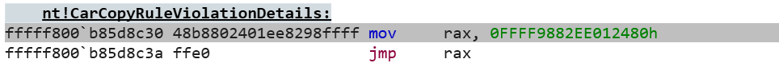
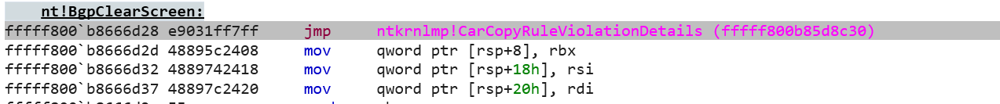

# KmHookX
A comprehensive hooking mechanism that fixes offsets and places a trampoline at the beginning of a function. It writes to an unused function location, then uses a 16-bit displacement offset to jump into the trampoline. This process is guided by disassembly using the Capstone framework for precise analysis.
# How does it work?
KmHookX overrides the untriggered function (CarCopyRuleViolationDetails) with a simple mov rax and jmp rax shellcode:

Then, KmHookX creates an exact copy of a function in an allocated pool, it writes a jmp 16-bit displacement to the untriggered function (CarCopyRuleViolationDetails) (JMP nt!CarCopyRuleViolationDetails) and shifts the whole function down by 5 bytes overriding the INT3s at the end of the function: 

KmHookX takes that allocated pool, and changes all of the offsets to the correct offset ensuring that the flow wont jump into an invalid address.
After that, KmHookX commits the contents in the pool to the target function with the modifications applied. The original function is stored at nt!target_function+0x5 now.

and thats it, you can monitor all of functions no matter if its in ntoskrnl or win32kfull.sys.

# How to use it?
1. Clone this repo using (git clone https://github.com/krypt0nx/KmHookX.git) and move it to any folder in your favor.
2. Open the cloned repo, and open folder cs_driver.
3. Open cs_driver.sln with visual studio.
4. press Build->Rebuild solution
5. When your done, in solution explorer, right click on "capstone_static" and press "unload project".

And your done! Now you can edit the file main.cpp and use the hooking library. If you need, you can integrate your existing project there. 

# Library usage

## 1. KmHookFunction

